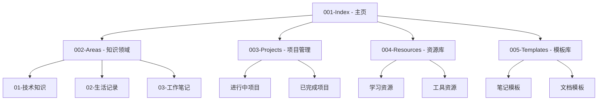

# Index - 笔记体系索引

欢迎来到我的笔记体系！这是一个系统化、结构化的知识库，帮助我组织和管理各种知识和信息。

## 📊 体系概览

## 🏠 体系结构说明

### 001-Index (本页)
- **功能**：整个笔记体系的入口和导航
- **内容**：体系结构说明、快速链接、使用指南

### 002-Areas (知识领域)
- **功能**：按知识领域分类的笔记集合
- **结构**：
  - 01-技术知识：编程、系统、网络等
  - 02-生活记录：日记、旅行、思考等
  - 03-工作笔记：会议记录、工作流程等

### 003-Projects (项目管理)
- **功能**：项目相关的笔记和管理文档
- **内容**：项目计划、进度追踪、总结等

### 004-Resources (资源库)
- **功能**：学习资料、工具列表、参考资源
- **内容**：书籍、课程、工具推荐、链接收藏等

### 005-Templates (模板库)
- **功能**：各种用途的笔记模板
- **内容**：会议记录模板、读书笔记模板、项目模板等

## 🚀 使用方法

### 快速导航
- 使用页面顶部的目录跳转
- 点击标题或标签进行关联查询
- 使用 Obsidian 的搜索功能查找内容

### 笔记创作
1. 在对应领域创建新笔记
2. 添加适当的标签和分类
3. 建立笔记间的关联链接
4. 定期更新和整理

## 🎯 核心原则

- **结构化**：按逻辑分类组织内容
- **关联化**：通过双向链接建立知识网络
- **简洁化**：保持笔记内容简洁明了
- **更新化**：定期回顾和更新笔记

## 📝 联系我

如有问题或建议，欢迎与我联系！

---

> *"好的笔记体系是知识管理的基础"*
