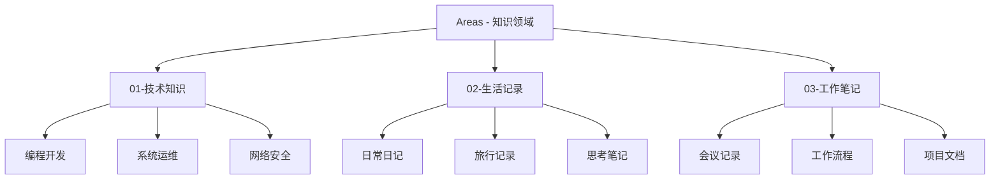

# Areas - 知识领域

这是我的知识领域分类体系，用于按主题和领域组织各种笔记内容。

## 📚 知识领域架构

## 🎯 领域分类

### 01-技术知识 (Technology)

**内容范畴**：
- 编程开发
- 系统运维
- 网络安全
- 数据科学
- 人工智能

**特色笔记**：
- [Obsidian 集成 OpenClaw](003-Projects/01-公众号/Obsidian%20集成%20OpenClaw%20我的第二个会思考的大脑.md)
- [网络安全笔记](002-Areas/04-视频资料/公孙田浩/【互联网黑产博弈001】五亿微博数据泄露，我查到了当代明星网红手机号。.md)

### 02-生活记录 (Life)

**内容范畴**：
- 日常日记
- 旅行记录
- 思考笔记
- 生活经验

**特色笔记**：
- [今日日记](002-Areas/02-生活记录/2026-02-24.md)
- [公孙田浩视频笔记](002-Areas/04-视频资料/公孙田浩/【调查实录001】我是如何追踪小偷，找回手机的.md)

### 03-工作笔记 (Work)

**内容范畴**：
- 会议记录
- 工作流程
- 项目文档
- 工作总结

**特色笔记**：
- 待添加...

## 📖 使用说明

### 如何添加笔记

1. 确定笔记所属领域
2. 在对应文件夹中创建新笔记
3. 添加必要的标签和分类
4. 建立与其他笔记的关联链接

### 标签使用规范

- `#技术` 用于技术类笔记
- `#生活` 用于生活类笔记
- `#工作` 用于工作类笔记
- `#学习` 用于学习资料
- `#工具` 用于工具介绍

## 🔄 更新记录

- **2026-02-24**：创建知识领域分类体系
- **2026-02-24**：添加技术知识、生活记录、工作笔记三个主要领域
- **2026-02-24**：链接相关笔记到对应的领域分类

---

> *"知识的价值在于分类和组织"*
