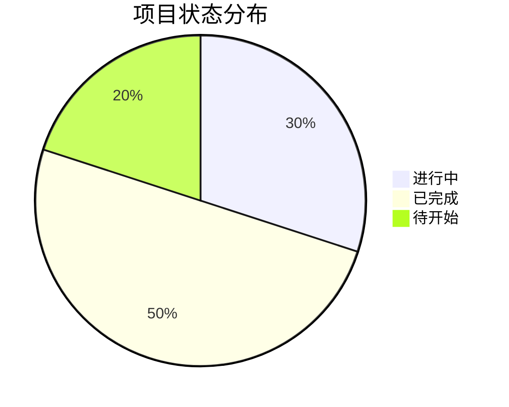

# Projects - 项目管理

这是我的项目管理页面，用于跟踪和管理各个项目的进度和信息。

## 📊 项目统计

## 🚀 项目列表

### 进行中项目

1. **OpenClaw 集成开发**
   - **状态**：进行中
   - **描述**：Obsidian 与 OpenClaw 的深度集成
   - **最后更新**：2026-02-24
   - **链接**：[项目详情](../微信公众号/Obsidian%20集成%20OpenClaw%20我的第二个会思考的大脑.md)

2. **笔记体系优化**
   - **状态**：进行中
   - **描述**：当前正在构建的笔记体系
   - **最后更新**：2026-02-24
   - **链接**：[项目详情](../001-Index.md)

3. **网络安全学习**
   - **状态**：进行中
   - **描述**：学习网络安全知识
   - **最后更新**：2026-02-24
   - **链接**：[项目详情](../10-视频资料/公孙田浩/)

### 已完成项目

1. **GitHub 配置**
   - **状态**：已完成
   - **描述**：配置 GitHub SSH 和仓库
   - **完成时间**：2026-02-24

2. **OpenClaw 安装**
   - **状态**：已完成
   - **描述**：安装和配置 OpenClaw
   - **完成时间**：2026-02-24

3. **公孙田浩视频笔记整理**
   - **状态**：已完成
   - **描述**：将视频笔记转换为 Markdown 格式
   - **完成时间**：2026-02-24

## 📈 项目管理方法

### 项目跟踪模板

每个项目应包含：
- 项目概述
- 目标和里程碑
- 进度追踪
- 资源需求
- 风险评估

### 常用工具

- **进度追踪**：GitHub Projects
- **文档协作**：Obsidian
- **时间管理**：待添加...

## 📝 项目管理原则

1. **明确目标**：每个项目都要有清晰的目标
2. **分阶段实施**：将项目分解为可管理的阶段
3. **定期回顾**：每周或每月回顾项目进度
4. **记录经验**：记录项目中的经验教训

---

> *"项目管理的核心是平衡范围、时间和成本"*
