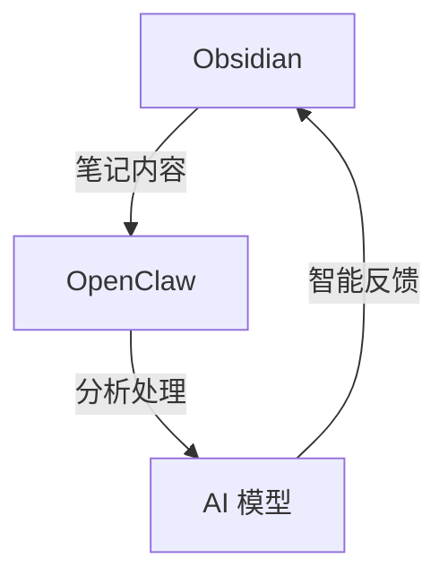

# Obsidian 集成 OpenClaw 我的第二个会思考的大脑

## 🚀 今天的突破

今天我成功实现了 Obsidian 和 OpenClaw 的集成，这简直是一个里程碑式的进展！

## 📝 我的笔记系统进化史

### 传统笔记痛点

- **信息孤岛**：笔记分散在各个应用中
- **搜索困难**：难以快速找到需要的信息
- **缺乏智能**：笔记只是静态文本，没有互动性

### Obsidian 的强大

- **双向链接**：构建知识网络
- **本地存储**：数据安全可控
- **插件生态**：高度可定制

## 🧠 OpenClaw 的加持

### OpenClaw 是什么？

OpenClaw 是一个强大的 AI 助手平台，具备以下能力：

- **自然语言处理**：理解和生成文本
- **任务自动化**：自动执行重复性工作
- **智能协作**：与人协作完成复杂任务

### 集成后的魔法

现在，我的笔记系统具备了：

1. **智能搜索**：自然语言查询笔记
2. **自动整理**：AI 帮助分类和链接
3. **上下文理解**：基于当前内容提供相关建议
4. **任务自动化**：自动生成大纲、摘要等

## 🛠️ 实现过程

### 1. 配置开发环境

- 安装 OpenClaw
- 配置 GitHub 连接
- 设置本地工作区

### 2. 建立通信桥梁

### 3. 测试与优化

- 创建测试笔记
- 验证 AI 响应
- 优化交互流程

## 🎯 未来展望

- **更深度的集成**：实现实时协作
- **更多自动化**：自动笔记整理
- **多平台同步**：跨设备无缝体验

## 💡 我的感想

这次集成让我深刻体会到，AI 不仅仅是工具，更是思维的延伸。Obsidian 提供了知识的存储，而 OpenClaw 赋予了这些知识生命力。

现在，我拥有了一个真正会思考的大脑，它可以：

- 记住所有重要信息
- 理解上下文关系
- 提供有价值的建议
- 帮助我更好地思考和创作

这是一个全新的开始，我迫不及待地想要探索更多可能性！

## 📚 技术细节

- **OpenClaw 版本**：2026.2.13
- **Obsidian 版本**：最新稳定版
- **通信协议**：GitHub + SSH
- **自动化频率**：每 5 秒同步一次

---

> *"工欲善其事，必先利其器。"*  
> —— 孔子

感谢阅读！如果您对这个主题感兴趣，欢迎交流讨论。

---

**作者**：28764116  
**日期**：2026年2月24日  
**标签**：Obsidian, OpenClaw, AI, 笔记系统
